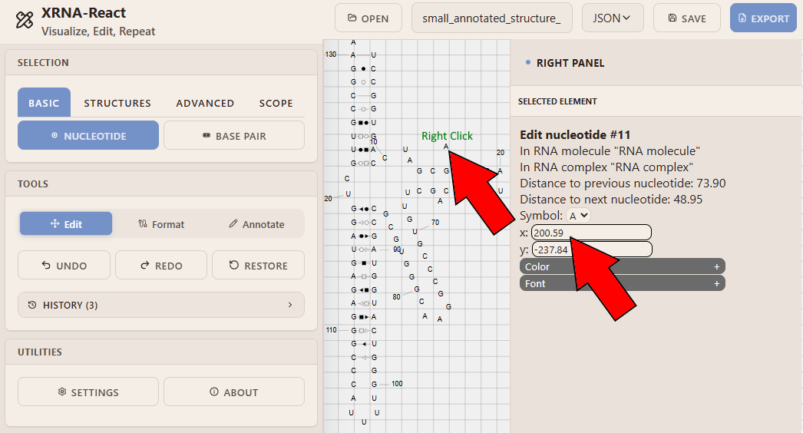

# XRNA-React
[](https://github.com/LDWLab/XRNA-React/releases)

<!-- [](https://github.com/LDWLab/XRNA-React/actions) -->
**XRNA-REACT** is a modern, browser-based application for editing RNA secondary-structure diagrams.
## Live Version
A live, installation-free version of XRNA is available at https://ldwlab.github.io/XRNA-React/
## Features
- Interactive display of RNA secondary-structures.
- Dynamic editing, reformatting and annotation.
- Export data in several formats including (but not limited to) SVG images and JSON data files.
## Installation / Running Locally
To run XRNA-React locally:
```bash
# Install dependencies
npm install
# Start the development server
npm run start
```
The app will we served at `http://localhost:3000`
## Interaction Instructions
<details>
<summary>Example Diagrams (click to expand)</summary>
Initialize the application by uploading an XRNA-compatible data file.


Now that data is uploaded, pick a constraint to guide your work in XRNA.


With the nucleotide constraint selected and the edit tool active, we can left-click and drag to reposition a single nucleotide at a time.


Note that it is also possible to edit nucleotide positions via a right click, which populates the right-hand menu according to the current contstraint and the clicked-on nucleotide.



Now, let's add a base pair to nucleotide #11 (the current nucleotide) via the format menu.


Now that the add-basepair row is visible, populate fields **left to right** to specify both ends of the base pair (e.g. A11, U61). Then, click Add


The base pair has been successfully added! Let's move on and annotate the base pair. Activate the Annotate tool. Select the base-pair constraint. Then, right-click on one of the two newly base-paired nucleotides.


Use the right-hand menu to specify annotation settings.


Now that we have finished our edits, let's export our data.


</details>

## Citation
XRNA-React is currently unpublished. Upon publication, citation instructions will be displayed here.

## Contact
For questions, issues or collaboration inquiries, please contact:
- **Caeden Meade**: caedenmeade@gmail.com
- **Anton Petrov**: anton.s.petrov@gmail.com